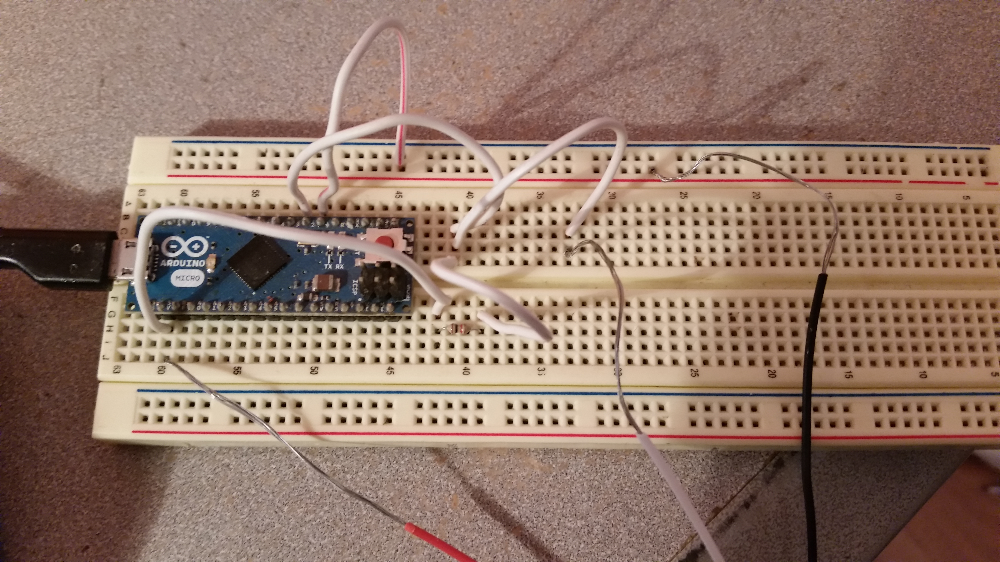

arduinogbdump
=============

This is a project that can **create GB/GBC ROMs from real cartridges**, as
well as **copy save data to/from real cartridges.**

Required hardware:  an Arduino, an N64 controller, an N64 Transfer Pak, and
a pull-up resistor.

arduinogbdump is heavily based on brownan's [Gamecube-N64-Controller](https://github.com/brownan/Gamecube-N64-Controller)

#Features/Compatibility
**Note**:  All GB and GBC **Pokemon** games *should* be possible to dump
with arduinogbdump.  Not every Pokemon game has been tested, but it is
believed by the author that all Pokemon games use a supported MBC.

There is currently support for dumping ROMs from cartridges of the
following types:
  1.  ROM Only (32 kiB)
  2.  MBC2
  3.  MBC3
  4.  MBC5 (incomplete support, only works for ROMs up to 4 MiB)

There is currently support for dumping RAM from cartridges of the following
types:
  1.  MBC2
  2.  MBC3 (No RTC support yet)
  3.  MBC5

There is currently support for restoring RAM to cartridges of the following
types:
  2.  MBC3 (No RTC support yet)
  3.  MBC5

All testing of the communicator program has been done on Linux.  It is not
known whether it would even compile on other systems, but there's a good
chance of it working on other Unices (such as FreeBSD).

#How to Connect the Arduino Board to the N64 Controller
Here is a photo of the setup (taken in January, 2015):

 
**Note**:  It is **not** necessary to break the N64
controller's cable (though the controller cable can certainly be
re-connected if the user chooses to break it).  Wires can be inserted into
the holes at the end of the N64 controller's cable.  The holes correspond
to the red, white, and black wires of the N64 controller (though the author
*does not* know which order the holes are in).

  1.  Attach the N64 controller's red wire to the Arduino's 3.3V supply.
  2.  **Attach a 1 kOhm pull-up resistor between the Arduino's digital I/O
  2 and the 3.3 supply.**
  3.  Attach the N64 controller's white wire to digital I/O 2.
  4.  Finally, attach the N64 controller's black wire to the Arduino's
  ground.

#Arduino Board Compatibility
As is the case with the Gamecube-N64-Controller project, the timing code is
specific to Arduino boards with 8-bit AVRs clocked at 16 MHz.

The following Arduino boards have been tested and are working with this
project for sure:
  1.  Arduino Micro

However, it is likely that the other Arduino boards that use the following
AVR microcontrollers would work as well:
  1.  ATmega32U4

Support for the Arduion Uno, Arduino Mega, and Arduino Mega 2560 is planned as well.

#Credits/Thanks
As previously mentioned, arduinogbdump is heavily based on [This](https://github.com/brownan/Gamecube-N64-Controller)

The 1964 emulator and the NRage plugin (compiled with debugging functions)
were really helpful in figuring out how real games (Pokemon Stadium 2 in
particular) used the Transfer Pak.  The NRage docs were also instrumental
for getting this to work.  Some of them have been included with this
project for reference.

The two CRC-related functions were taken from libdragon (though only one of
them is in use).

There were also various websites whose URLs escape me.

Additionally, the folks of IRC channel #n64dev on EFnet have been very
helpful, especially when I was first working on this project in Spring
2013.

